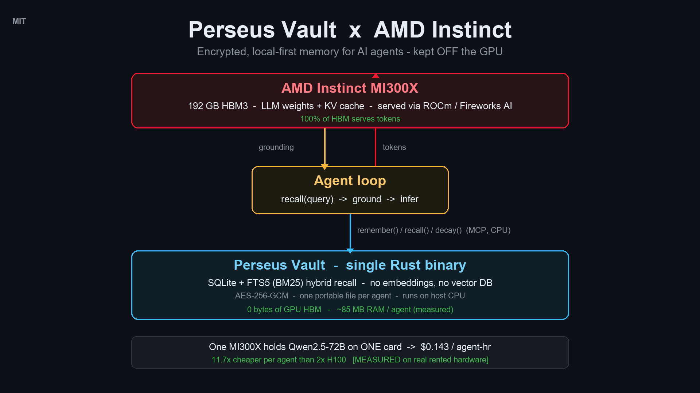

<div align="center">
  
</div>

# Perseus Vault × AMD Instinct

> **Encrypted, local-first, persistent memory for AI agents — kept off the GPU so
> every byte of MI300X HBM serves tokens.**

[](./LICENSE)
[]()
[]()
[]()
[](https://amd-demo.perseus.observer)

**AMD Developer Hackathon: Act II — Unicorn (Open) Track.** Built on
[Perseus Vault](https://github.com/Perseus-Computing-LLC/perseus-vault) — a
**shipping** MIT-licensed memory engine (v2.20, 35 releases, 56 MCP tools, live on PyPI
and the MCP registry), not a weekend build. lablab project:
[lablab.ai/…/perseus](https://lablab.ai/ai-hackathons/amd-developer-hackathon-act-ii/perseus).

> ### ▶ Judges, start here — try the live demo: **[amd-demo.perseus.observer](https://amd-demo.perseus.observer)**
> Teach the agent a fact, open a brand-new session, and recall it — then watch an
> **open-weight LLM (gpt-oss-120b) answer live via the Fireworks AI API** using *only*
> what it recalled. Recall + footprint run on the **host CPU (0 bytes of GPU HBM)**;
> the demo's cross-vendor economics table shows the projection model (MI300X and
> 2×H100 are now both measured — see the banner below). Run a decay tick too. No login,
> per-visitor sandbox, daily budget cap on inference.
>
> <sub>Fireworks AI is this hackathon's designated inference partner — the
> [organizers describe the credits](https://lablab.ai/ai-hackathons/amd-developer-hackathon-act-ii)
> as access to *"models hosted on AMD-hardware"*, and Fireworks is
> [partnering with AMD](https://fireworks.ai/blog/fireworks-amd-ai-infrastructure-partnership)
> to serve on Instinct accelerators. Like any serving API it does not attest which
> accelerator handles a given request, so we do not claim one ourselves. The memory
> layer never touches a GPU regardless.</sub>

> ### ⚠️ Honesty banner (please read)
> We rented a real **AMD Instinct MI300X** and measured the claims everything rests
> on, serving **Qwen2.5-72B** on vLLM/ROCm (host: AMD EPYC 9474F). Measured (medians):
> one card holds **15.3 concurrent 72B agents** at **$0.143/agent-hour** (validating
> our $0.133 projection); sustained **658 output tok/s** (peak 1,088) = **$0.92/1M
> output tokens** at retail rental — untuned bf16, no FP8/AITER, a floor not a ceiling;
> and the load-bearing result: with the MI300X **saturated serving the 72B**, recall on
> the host CPU moved **±0.6% (median of 6 runs, 18.7 → 18.8 ms p50)**. The memory layer
> steals ~zero inference cycles, proven under real load
> ([BENCHMARKS §3a](docs/BENCHMARKS.md#3a-measured-on-a-real-mi300x--data_source-measured)).
> We then rented **2× H100 SXM** and measured the cross-vendor claim too: best-case
> 5.0 concurrent agents at $1.68/agent-hr vs the MI300X's 15.3 at $0.143 —
> **11.7× measured-vs-measured, vs 2× H100** (a single H100 cannot load the model at all).
> We also rented and measured **8× A100 40GB** (57.9 agents, $0.275/agent-hr — but that's
> 8 cards to the MI300X's 1, so MI300X still wins 1.9× on $/agent-hr and 2.1× per card).
> And **2× A100 80GB** (RunPod, eager@0.97 — the exact 2× H100 config): 6.37 agents at
> $0.436/agent-hr, MI300X 3.0× cheaper. **Every cross-vendor row is now measured — no
> projection remains.** Every number is tagged `data_source`:
> **`measured`** (timed live, reproducible now), **`published-spec`** (vendor
> datasheet / cloud price list, cited below), or **`projection`** (derived from
> published-spec inputs with stated assumptions). **No projected number is presented
> as measured.** The demo and benchmark scripts print this warning on every run.

---

## Problem

An AI agent is only as smart as what it remembers — but its "memory" is usually just
the LLM context window, which dies when the session ends. The common fix is to bolt on
a vector database: embed everything, store the vectors, do nearest-neighbour search at
recall. That buys persistence at a steep price:

- a **second system of record** (Postgres/pgvector, Pinecone, a Docker sidecar) that
  drifts out of sync with the agent's state;
- an **embedding model on the hot path** for every write and query — latency and GPU
  cycles spent before the *actual* model runs;
- **HBM pressure** — if the index or embedder shares the accelerator, it eats the very
  memory you wanted for weights and KV cache.

On an AMD Instinct MI300X, that last point is the whole game. Its **192 GB of HBM3** is
the scarce resource. Every gigabyte spent storing what the agent *knows* is a gigabyte
not serving tokens.

**Two markets feel this hardest.** Teams **bleeding tokens** re-feeding the same context
into every session; and **regulated orgs** — finance, defense, healthcare, the ones
already banning cloud AI tools — that legally *cannot* send agent memory to a cloud API
at all. A vector-DB-in-the-cloud serves neither well. An encrypted, local-first,
off-the-GPU memory layer serves both.

## Solution

**Perseus Vault** is a single Rust binary that gives an agent durable memory over the
Model Context Protocol (MCP). Its recall path is **SQLite + FTS5 hybrid search** (BM25
lexical ranking blended with a recency/decay prior) — **no embedding model, no external
vector database, no GPU.**

That's the design, not a limitation. The memory layer runs on the **host CPU** beside
the accelerator, so:

- **100% of the MI300X's 192 GB HBM3 stays available for weights + KV cache.**
- Recall adds **zero GPU work** and never competes with inference for the accelerator.
- **One GPU backs many concurrent agents** — each with its own AES-256-GCM-encrypted
  memory file (~85 MB RAM + ~45 MB disk per 100K memories, **measured**), because those
  files live in host RAM/disk, not HBM.

## Architecture

```
                     AMD Instinct MI300X (192 GB HBM3)
                  +------------------------------------+
 user turn ─────► | LLM weights + KV cache (inference) |
     ▲            | via Fireworks AI / vLLM / ROCm     |
     │            +------------------------------------+
     │ recall THEN infer     ▲ grounding │ tokens
     │                    ┌───────────────┐
     └────────────────────┤  Agent loop   │
                          └───────────────┘
                             ▲ remember() / recall() / decay()  (MCP, CPU only)
                    ┌───────────────────────────────┐
                    │ Perseus Vault (Rust binary)    │
                    │ SQLite+FTS5 · AES-256-GCM      │  ── 0 bytes HBM
                    │ one portable .db file / agent  │
                    └───────────────────────────────┘
                          host CPU + RAM + disk
```

Full write-up: **[docs/ARCHITECTURE.md](docs/ARCHITECTURE.md)**.

## Benchmarks

Full tables, sources, and reproduction steps: **[docs/BENCHMARKS.md](docs/BENCHMARKS.md)**.
Reproduce §1–§2 with `python3 src/benchmark.py`.

### Recall latency stays in low milliseconds as the store grows 100× — `measured`
Reference implementation (`src/benchmark.py`, AMD-CPU laptop, Python 3.14):

| Entries | Recall p50 (ms) | Recall p99 (ms) | Insert ops/s |
|---|---|---|---|
| 1,000   | 0.20  | 0.39  | 72,917 |
| 10,000  | 1.14  | 1.44  | 72,217 |
| 100,000 | 11.87 | 15.67 | 68,276 |

Shipping engine (Perseus Vault v2.20.0, **measured**, AMD CPU — see
[PERF.md](https://github.com/Perseus-Computing-LLC/perseus-vault/blob/main/PERF.md)):
FTS5 recall **15.7 ms p50 / 23.2 ms p99** @100K, **hybrid recall 79.7 ms p50**
(**3.7× faster since v2.19** — [#511](https://github.com/Perseus-Computing-LLC/perseus-vault/blob/main/PERF.md)),
bi-temporal `as_of` **~0.1 ms flat**; bulk insert **98,732 entities/s**.

### Footprint stays tiny — `measured`

| Entries | DB file (MB) | RSS (MB, shipping engine) |
|---|---|---|
| 1,000   | 0.31  | — |
| 10,000  | 2.61  | — |
| 100,000 | 25.95 | ~85 |

### One accelerator serves N agents — `measured` on MI300X **and** 2×H100

**Measured on both sides (2026-07-09, same model, same vLLM 0.19.1, n=3 medians —
[BENCHMARKS §3a–3b](docs/BENCHMARKS.md#3a-measured-on-a-real-mi300x--data_source-measured)):**

| Serving Qwen2.5-72B bf16 | 1× MI300X | 2× A100 80GB | 2× H100 SXM | 8× A100 40GB |
|---|---|---|---|---|
| GPUs | **1** | 2 | 2 | 8 |
| Config | standard | eager @0.97 | eager @0.97 (best case) | standard |
| Concurrent 8K agents | **15.3** | **6.37** | **5.0** | **57.9** (7.2/card) |
| **GPU $/agent-hour** | **$0.143** | **$0.436** | **$1.68** | **$0.275** |
| $ / 1M output tokens | **$0.92** | $1.04 | $3.42 | $1.92 |

*All four rows measured (Qwen2.5-72B bf16, vLLM 0.19.1). The 2× A100 80 GB and 2× H100 rows use the identical eager@0.97 config for a fair 160 GB comparison; a single H100 can't load the model at all. The 8× A100 is 320 GB (overprovisioned) — strong per-agent cost but eight cards vs one.*

**11.7× lower $/agent-hour and 3.7× lower $/token vs 2× H100 — measured, not projected.**
At the *identical* configuration the H100 pair serves **zero** 8K requests (KV exhausted);
its 5.0 figure is the best case that boots. (H100 does win per-stream decode latency, 39 vs
83 ms TPOT — stated plainly.) We also **rented and measured 8× A100 40GB** (Lambda):
57.9 concurrent agents at **$0.275/agent-hr** — but that is eight cards to the MI300X's one,
so per-card the MI300X still leads (15.3 vs 7.2 agents/card) and wins **1.9×** on
$/agent-hour. The **2× A100 80GB** config is now **measured** too (RunPod, eager@0.97 —
the same config as the 2× H100): 6.37 agents at $0.436/agent-hr, so the MI300X is 3.0×
cheaper (the old ~$0.47 projection was validated). Perseus Vault memory runs on the CPU
(~$0.0004/agent-hr ≈ 0.3% of the agent's cost) and uses **0 bytes of HBM**. Reproduce:
`python3 src/economics.py` (projection model) + [BENCHMARKS §3a–3b](docs/BENCHMARKS.md)
(measured runs, exact commands).

## Quick start

```bash
git clone https://github.com/tcconnally/perseus-amd-act-ii.git
cd perseus-amd-act-ii

# 1) Run the agent end-to-end (stdlib only, no GPU, no network needed):
python3 src/agent_memory_demo.py

# 2) Reproduce the measured benchmark tables + economics:
python3 src/benchmark.py            # add --quick to skip the 100K row

# 3) (optional) Real inference via the Fireworks AI API (open-weight model):
cp .env.example .env                # then set FIREWORKS_API_KEY
python3 src/agent_memory_demo.py

# 4) (optional) Run against the real Perseus Vault Rust binary:
curl -sSf https://raw.githubusercontent.com/Perseus-Computing-LLC/perseus-vault/main/scripts/install.sh | sh
PERSEUS_VAULT_BIN=~/.local/bin/perseus-vault python3 src/agent_memory_demo.py
```

### Docker (ROCm base — GPU-ready)

```bash
docker build -t perseus-amd-act-ii .          # FROM rocm/dev-ubuntu-22.04:6.2
docker run --rm perseus-amd-act-ii            # runs the demo
docker run --rm perseus-amd-act-ii python3 src/benchmark.py --quick

# On an AMD GPU host, expose the accelerator:
docker run --rm --device=/dev/kfd --device=/dev/dri --group-add video \
  -e FIREWORKS_API_KEY=... perseus-amd-act-ii
```

## Published-Spec Estimates

GPU rows above are **not measured**. They come from vendor datasheets and 2026 cloud
price lists:

- **AMD Instinct MI300X** — 192 GB HBM3, 5.325 TB/s bandwidth, 1,307.4 TFLOPS FP16
  (peak), 750 W TDP.
  [AMD MI300X datasheet (PDF)](https://www.amd.com/content/dam/amd/en/documents/instinct-tech-docs/data-sheets/amd-instinct-mi300x-data-sheet.pdf) ·
  [product page](https://www.amd.com/en/products/accelerators/instinct/mi300/mi300x.html) ·
  ROCm software: [rocm.docs.amd.com](https://rocm.docs.amd.com/).
- **NVIDIA H100 SXM** — 80 GB HBM3, 3.35 TB/s, ~989 TFLOPS FP16, 700 W.
- **NVIDIA A100 80GB SXM** — 80 GB HBM2e, 2.039 TB/s, 312 TFLOPS FP16, 400 W.
- **Cloud pricing (2026, per-GPU-hour):** MI300X median ~$2.72 (from ~$1.99); H100
  ~$3.93; A100 80GB ~$1.80. Sources: cloud-GPU price trackers
  ([getdeploying](https://getdeploying.com/reference/cloud-gpu),
  [thundercompute](https://www.thundercompute.com),
  [gpucost.org](https://gpucost.org)), July 2026. Spot prices vary — but the headline
  cross-vendor ratio no longer depends on tracker prices: it is **measured** at the
  rates we actually paid ($2.19 MI300X, $8.38 2×H100 → 11.7×,
  [BENCHMARKS §3b](docs/BENCHMARKS.md)). Even at a findable ~$2.85/hr per H100
  ($5.70 for the pair), the measured agent ceilings give $1.14 vs $0.143 → **8.0×**.
- **Model assumption:** Llama-3.1-70B, FP16 weights ~141 GB; KV cache per 8K-token
  sequence ~2.5 GB (80 layers, 8 GQA KV heads, head_dim 128, fp16). Derivation lives in
  `src/economics.py`.

## What We Measured on Real AMD Hardware — and What's Next

We rented real MI300X time (twice) and measured the load-bearing claims; the rest stay
on the list (details in
[docs/BENCHMARKS.md §4](docs/BENCHMARKS.md#4-what-we-measured-on-real-amd-hardware--and-whats-next)):

1. **✅ Done — recall on the host EPYC CPU while the MI300X is busy.** +0.6% under a
   synthetic 100%-utilization matmul (97.4 TFLOPS FP16,
   [§1](docs/BENCHMARKS.md#1-recall-throughput--latency--data_source-measured)) *and*
   **±0.6% (median, 6 runs) under a real vLLM serving load of Qwen2.5-72B**
   ([§3a](docs/BENCHMARKS.md#3a-measured-on-a-real-mi300x--data_source-measured)).
   The CPU memory layer steals ~no accelerator cycles.
2. **✅ Done — true concurrent-agent ceiling: 15.3** measured from vLLM's KV-cache
   budget serving a 72B on one MI300X (vs the ~20 idealized projection) — §3a.
3. End-to-end agent-turn latency (CPU recall + MI300X generation) vs a vector-DB baseline.
4. **✅ Done — measured $/agent-hour: $0.143** ($2.19/GPU-hr ÷ 15.3 agents) — §3a.
   *Still open:* peak serving throughput → measured $/1M tokens (our current throughput
   data is a single-process floor, so we don't headline it).
5. A ROCm/HIP prototype offloading Perseus Vault's dense re-rank to an idle GPU slice —
   an open question we'd answer with data, not claims.

## Bonus building block: Gemma on AMD — the whole agent on one chip

The hackathon's partner challenge asks for the best **AMD-hosted Gemma** project. On
Fireworks, Gemma is *on-demand* — you deploy it yourself, and even the cheapest option
(Gemma 4 E4B) bills **~$7/hour while idle**. Rather than pay to keep a model warm, we did
the more on-thesis thing and **self-hosted Gemma on AMD silicon for $0**:
[`src/gemma_on_amd.py`](src/gemma_on_amd.py) runs the same recall→infer architecture with
**Gemma 3 (4B-it, Q4_K_M GGUF) served locally by llama.cpp on an AMD CPU**, right beside
the Perseus Vault memory layer — the fleet story scaled down to a single chip, with no
idle-billing meter running.

Measured on an **AMD Ryzen 7 9800X3D** (`measured`, reproduce with the script): recall
**0.21 ms** + Gemma generation **~13 tok/s wall-clock** — no GPU, no cloud, no API key.
One architecture across the AMD lineup: **Gemma on a Ryzen/EPYC host** for single-agent
boxes, **a 70B-class model on MI300X** for fleets — and the memory layer never moves.

```bash
# 1) llama.cpp:  winget install ggml.llamacpp   (or: brew install llama.cpp)
# 2) an open Gemma GGUF:
curl -LO https://huggingface.co/ggml-org/gemma-3-4b-it-GGUF/resolve/main/gemma-3-4b-it-Q4_K_M.gguf
# 3) serve + run:
llama-server -m gemma-3-4b-it-Q4_K_M.gguf --port 8081 --ctx-size 8192 &
python3 src/gemma_on_amd.py       # prints your CPU + measured numbers
```

## What's in this repo

| Path | |
|---|---|
| [`src/agent_memory_demo.py`](src/agent_memory_demo.py) | End-to-end stateful agent (learn → recall → infer → decay). |
| [`src/gemma_on_amd.py`](src/gemma_on_amd.py) | Bonus: Gemma 3 + Perseus Vault on one AMD CPU (partner challenge). |
| [`src/perseus_vault_store.py`](src/perseus_vault_store.py) | Memory interface: CPU reference store + real-binary bridge. |
| [`src/benchmark.py`](src/benchmark.py) | Measured throughput/footprint tables + economics. |
| [`src/economics.py`](src/economics.py) | The "one MI300X serves N agents" model. |
| [`docs/ARCHITECTURE.md`](docs/ARCHITECTURE.md) | Design + the off-the-GPU thesis. |
| [`docs/BENCHMARKS.md`](docs/BENCHMARKS.md) | All tables, sources, reproduction. |
| [`docs/SUBMISSION.md`](docs/SUBMISSION.md) | Every lablab form field, pre-filled. |
| [`Dockerfile`](Dockerfile) | ROCm-based, GPU-ready container. |

## Not a weekend hack — a shipping product

Most hackathon entries are born this week. Perseus Vault is a real product we brought
*to* AMD — which is why the memory layer here is production-grade, not a prototype:

- **Mature:** v2.20, **35 releases**, single ~8 MB Rust binary, **56 MCP tools**, AES-256-GCM.
- **Distributed everywhere agents live:** published to **PyPI** as five framework adapters —
  [LangChain](https://pypi.org/project/langchain-perseus-vault/),
  [CrewAI](https://pypi.org/project/crewai-perseus-vault/),
  [PydanticAI](https://pypi.org/project/pydantic-ai-perseus-vault/),
  [Haystack](https://pypi.org/project/perseus-vault-haystack/),
  [Google ADK](https://pypi.org/project/adk-perseus-vault-memory/) — and listed in the
  **MCP registry**, **Smithery**, and **Glama** (`server.json` / `smithery.yaml` / `glama.json`).
- **Running in production today.** (The live demo above runs this repo's CPU reference
  implementation of the same recall path — see `webdemo/` — not the Rust binary.)

### Why this matters to AMD

Agent memory is a real, growing market (Mem0, Letta, Zep). Today those stateful-agent
workloads default to NVIDIA. Perseus Vault removes the reason they'd have to: by keeping
memory **off the accelerator**, it makes the MI300X's 192 GB HBM3 the cheapest place to
run a *fleet* of durable agents (**measured $0.143/agent-hr on a real MI300X — 11.7×
under a measured 2×H100 baseline**,
see [benchmarks](docs/BENCHMARKS.md)). And because the memory is local-first, **air-gap
mode loses nothing** — the regulated buyers who most need on-prem get the *full* product,
not a degraded one (many stateful-agent tools quietly disable their best features
offline; ours don't). In one line: **Perseus Vault turns AMD Instinct into the economical
home for the agent economy** — an adoption wedge for Instinct, not just another memory tool.

## About

Built by **Perseus Computing LLC** (Wyoming). Perseus Vault is MIT-licensed and
production-deployed. This submission is original and MIT-compliant.

## License

[MIT](./LICENSE) © 2026 Perseus Computing LLC.
